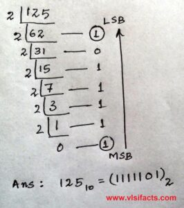

# DATASTRUCTURES

### Table of Contents

| No. | Questions                                                                                       |
| --- | ------------------------------------------------------------------------------------------------| 
| 1 | [Data Structure](#what-is-a-data-structure)                                                       |
| 2 | [Algorithm](#what-is-an-algorithm)                                                                |
| 3 | [](#)                                                                                             |
| 4 | [](#)                                                                                              |
| 5 | [](#)                                                                                               |
| 7 | [](#)                                                                                               |
| 8 | [](#)                                                                                               |
| 9 | [](#)                                                                                               |
| 10 | [](#)                                                                                              |
| 101 | [ Even or Odd](#check-even-or-odd)                                                                |
| 102 | [ Multiplication table](#multiplication-table)                                                    |
| 103 | [ Sum of first n Natural Numbers ](#find-sum-of-first-n-natural-numbers)                          |
| 104 | [ Swap two numbers ](#how-to-swap-two-numbers-without-using-a-temporary-variable)                 |
| 105 | [ Closest number divisible by m](#find-the-number-closest-to-n-and-divisible-by-m)                |
| 106 | [ Dice Problem ](#dice-problem)                                                                   |
| 107 | [ Simple Interest ](#simple-interest)                                                             |
| 108 | [ Area of a Circle ](#area-of-a-circle)                                                           |
| 109 | [ Sum of the digits of a given number ](#sum-of-the-digits-of-a-given-number)                                       |
| 110 | [ Prime Number ](#check-for-prime-number)                                                                           |
| 111 | [ Exactly 3 divisors](#find-numbers-from-1-to-n-with-exactly-3-divisors)                                            |
| 112 | [ Check if a number is a power of another number](#check-if-a-number-is-a-power-of-another-number)                  |
| 113 | [ Factorial of a Number ](#factorial-of-a-number)                                                                   |
| 114 | [ Square root of an integer ](#square-root-of-an-integer)                                                           |
| 115 | [ Find GCD or HCF of Two Numbers ](#find-gcd-or-hcf-of-two-numbers)                                                 |
| 116 | [ Find LCM of two numbers ](#find-lcm-of-two-numbers)                                                               |
| 117 | [ Jumping Numbers](#jumping-numbers-smaller-than-or-equal-to-a-given-value)                                         |
| 118 | [ Perfect Number ](#perfect-number)                                                                                 |
| 119 | [ Add two fractions ](#add-two-fractions)                                                                           |
| 120 | [ Fraction to Recurring Decimal ](#fraction-to-recurring-decimal)                               |
| 121 | [ Find Recurring Sequence in a Fraction ](#find-recurring-sequence-in-a-fraction)                               |
| 122 | [ print Sum of even and odd elements in an array ](#write-a-program-to-print-sum-of-even-and-odd-elements-in-an-array)                               |
| 123 | [ Decimal to Binary Conversion ](#write-a-program-for-decimal-to-binary-conversion)                               |
| 124 | [ Calculate distance between two points ](#write-a-program-to-calculate-distance-between-two-points)                               |
| 125 | [ Armstrong Numbers](#program-for-armstrong-numbers)                               |
| 126 | [ Maximum and minimum of an array ](#maximum-and-minimum-of-an-array-using-minimum-number-of-comparisons)|
| 127 | [ Array Reverse ](#array-reverse)                                                      |
| 128 | [ Cyclically rotate an array by one ](#program-to-cyclically-rotate-an-array-by-one)     |              
| 129 | [ Array Sorting ](#array-sorting)                                                                    |
| 130 | [ Duplicate elements in an array ](#find-duplicate-elements-in-an-array)                                    |
| 131 | [ Find distinct values from array ](#find-distinct-values-from-array)                                     |
| 132 | [](#)                                                                                              |
| 133 | [](#)                                                                                              |
| 134 | [](#)                                                                                              |
| 201 | [ Check for Binary](#Check-for-Binary) |                                                           |       
| 202 | [ Camel Case Conversion](#Camel-Case-Conversion) |                                                 |
| 203 | [ Binary Substrings with Corners as 1s](#Binary-Substrings-with-Corners-as-1s) |                   |
| 204 | [ Check for Panagram](#Check-for-Panagram) |                                                       |
| 205 | [Check for Palindrome] (#)                                                                        |
| 206 | [Check for Substring] (#)                                                                         |
| 207 | [Check for Subsequence] (#)                                                                       |
| 208 | [Check for Anagrams] (#)                                                                          |
| 209 | [Check for K-Anagrams] (#)                                                                        |  
| 210 | [Duplicates in a String] (#)                                                                      |
| 211 | [Longest Substring Between Equals] (#)                                                            |
| 212 | [Left Rotate] (#)                                                                                 |
| 213 | [Check for Rotation] (#)                                                                          |
| 214 | [Validate an IP address] (#)                                                                      |
| 215 | [Count strings with consecutive 1’s] (#)                                                          |
| 216 | [Generate all binary strings from given pattern] (#)                                              |
| 217 | [Smallest and Largest Word in a String]                                                           |
| 218 | [Count number of equal pairs in a string]                                                         |
| 219 | [Second most repeated word in a sequence]                                                         |
| 220 | [All strings by placing spaces]                                                                   |
| 221 | [Sort string of characters]                                                                       |
| 222 | [Char Frequencies in Order of Occurrence]                                                         |
| 223 | [Char Frequencies in Alphabetical order]                                                          |
| 224 | [URLify a String]                                                                                 |
| 225 | [First Repeating Character]                                                                       |
| 226 | [First Non-Repeating Character]                                                                   |
| 1 | [K’th Non-repeating Character]                                                                    |
| 1 | [Implement atoi]                                                                                  |
| 1 | [Add 2 Binary Strings]                                                                            |
| 1 | [Add n Binary Strings]                                                                            |
| 1 | [Multiply 2 Strings]                                                                              |
| 1 | [Divide large number]                                                                             |
| 1 | [Isomorphic Strings]                                                                              |
| 1 | [Remove Adjacent]                                                                                 |
| 1 | [Roman to Integer]                                                                                |
| 1 | [Interleaved Strings]                          |
| 1 | [Permutations of a String]                          |
| 1 | [Longest Palindromic Substring]                          |
| 1 | [Queries for characters in a repeated string]                          |
| 1 | [Count anagram substrings]                          |
| 1 | [Count binary strings without consecutive 1’s]                          |
| 1 | [Lexicographically next string]                          |
| 1 | [Split String into four distinct strings]                          |
| 1 | [Word Break Problem]                          |
| 1 | [Length of Longest Balanced Subsequence]                          |
| 1 | [Minimum Swaps for Bracket Balancing]                          |
| 1 | [String to mobile numeric keypad sequence]                          |
| 1 | [Minimum number from given sequence]                          |
| 1 | [Shortest path to print a string on screen]                          |
| 1 | [Mirror characters of a string]                          |
| 1 | [Lexicographic Rank of a String]                          |
| 1 | [Multiply Large Numbers]                          |
| 1 | [Ways to increase LCS length of 2 strings by one]                          |
| 1 | [Min rotations required to get the same string]                          |
| 1 | [Find if an array of strings can be chained to form a circle]                          |
| 1 | [Alien Dictionary]                          |
| 1 | [Make two strings Anagram]                          |
| 1 | [Make two Strings Anagram Without Deletion]                          |
| 1 | [Palindrome Substring Queries]                          |
| 1 | [Powet Set in Lexicographic order]                          |
| 1 | [Minimum Word Break]                          |
| 1 | [Word Search - 8 Directions and Straight Movement]                          |
| 1 | [Word Search - 4 Directions and Zig-Zag Allowed]                          |
| 1 | [Minimum number of bracket reversals needed to make an expression balanced]                          |
| 1 | [Word Wrap problem ( Space optimized solution )]                          |
| 1 | [Decode a string recursively encoded as count followed by substring ]           |


**[⬆ Back to Top](#table-of-contents)**

----------------------------------------------------------------------------------------------------------------------
1. ### What is a Data Structure?
A data structure is a specialized way of organizing, managing, and storing data so it can be accessed and modified efficiently.

**Types of Data Structures**
1. Linear Data Structures: Data is arranged sequentially.
* Array: Collection of elements stored at contiguous memory locations.
* Linked List: Elements (nodes) are connected using pointers.
* Stack: Follows the LIFO (Last In, First Out) principle.
* Queue: Follows the FIFO (First In, First Out) principle.

2. Non-Linear Data Structures: Data is arranged hierarchically or graphically.
* Tree: Hierarchical structure with a root node and child nodes (e.g., binary tree).
* Graph: Collection of nodes (vertices) connected by edges.
* Heap: Specialized tree-based data structure.

3. Hash-Based Structures:
* Hash Table/Map: Stores key-value pairs for quick lookups.

4. Other Advanced Structures:
* Trie: Used for efficient string searching.
* Disjoint Set (Union-Find): Used for dynamic connectivity problems


**[⬆ Back to Top](#table-of-contents)**

2. ### What is an Algorithm?
An algorithm is a step-by-step procedure or formula for solving a problem. It takes input, processes it, and produces output.

**Characteristics of a Good Algorithm**
* Correctness: Produces the right result for all valid inputs.
* Efficiency: Minimizes the use of computational resources (time and space).
* Clarity: Easy to understand and implement.
* Scalability: Performs well as the size of the input increases.


**[⬆ Back to Top](#table-of-contents)**

--------------------------------------------------------------------------------------------------------------------------

101. ### Check Even or Odd
```javascript
const input = 11
console.log("Is the number even ?", isEvenOrOdd(input))

function isEvenOrOdd(num){
    console.log(num)
    if(num %2 == 0 ){
        return "Even"
    }else{
        return "Odd"
    }
}
```


**[⬆ Back to Top](#table-of-contents)**

102. ### Multiplication Table
```javascript
    const tableUpto = 10;
    const tableOf = 7;
    multiplicationTable(tableOf, tableUpto);

    function multiplicationTable(tableOf, tableUpto){
        for(let i=1; i<=tableUpto; i++){
            console.log(tableOf , " x ", i , " = " ,tableOf * i)
        }
    }
```


**[⬆ Back to Top](#table-of-contents)**

103. ### Find Sum of first n Natural Numbers
```javascript
    function findSum(n)
    {
    let sum = 0;
    for (let x = 1; x <= n; x++) 
        sum = sum + x;
    return sum;
    }

    let n = 5;
    console.log(findSum(n));
```


**[⬆ Back to Top](#table-of-contents)**

104. ### How to swap two numbers without using a temporary variable?
```javascript
    let x = 10;
    let y = 15

    swapNumbers(x,y);

    function swapNumbers(i,j){
        console.log("Numbers before : ",  i , "  " , j)
        let temp = 0;
        temp = i;
        i = j;
        j = temp;
        console.log("Exchanged numbers : ", i , "  " , j)
    }
```


**[⬆ Back to Top](#table-of-contents)**

105. ### Find the number closest to n and divisible by m

For ex. num=17 , mul=4. Find a number closest num which is multiple of mul. Answer should be 16.

```javascript
let num = 19;
let mul = 4;
const closest = closestNumber(num, mul)
console.log('Closest number to ', num , "which is multiple of ", mul , " is : ", closest)

function closestNumber(num, multipleOf){
    let remainder = num % mul ; 
    let closer1  = num - remainder;
    let closer2  = num - remainder + mul;
    
    return (num-closer1 < closer2-num)?  closer1 : closer2;
}
```


**[⬆ Back to Top](#table-of-contents)**

106. ### Dice Problem

You are given a cubic dice with 6 faces. All the individual faces have a number printed on them. The numbers are in the range of 1 to 6, like any ordinary dice. You will be provided with a face of this cube, your task is to guess the number on the opposite face of the cube.

In a normal 6-faced dice, 1 is opposite to 6, 2 is opposite to 5, and 3 is opposite to 4. 

```javascript
    // 1-6  ,  2-5   ,  3-4

    let input = 5;
    oppositeFaceOfDice(input);

    function oppositeFaceOfDice(n){
            oppositeSide = 7-n ;
            console.log('Opposite side of ', n , ' is : ' , oppositeSide)
    }
```


**[⬆ Back to Top](#table-of-contents)**

107. ### Simple Interest
Given Principal p, Rate r and Time t, the task is to calculate Simple Interest.

```javascript
function simpleInterest(p, r, t) {
    return (p * r * t) / 100;
}

let p = 10000, r = 10, t = 3;
console.log(simpleInterest(p, r, t));
```


**[⬆ Back to Top](#table-of-contents)**

108. ### Area of a Circle
```javascript
    let input = 5;
    areaOfCircle(input);

    function areaOfCircle(n){
        area = Math.PI  *  Math.pow(n,2) ;
        console.log('Area : ' , area)
    }
```


**[⬆ Back to Top](#table-of-contents)**

109. ### Sum of the digits of a given number
```javascript
    let input = 123456;
    sumOfDigits(input);

    function sumOfDigits(num){
        let sum =  0;
        do{
            let remainder = num%10;            
            num -= remainder;                  
            num = num/10;                    
            sum +=remainder
        }while(num>0)
        console.log('Sum : ' , sum)
    }
```


**[⬆ Back to Top](#table-of-contents)**


110. ### Check for Prime Number
```javascript
   const input = 29;

    function isPrime(num){
        if(num<1) return false;
        if(num===2)  return true;
        for(let i =2 ; i<Math.sqrt(num);i++){
            if(num%i === 0) return false;
        }
        return true;
    }

    result=isPrime(input);
    console.log('Is prime ?  ', result)
```


**[⬆ Back to Top](#table-of-contents)**

111. ### Find numbers from 1 to N with exactly 3 divisors

Check numbers from 1 to N with exactly 3 divisors
Answer should be 16

```javascript
input = 20;
console.log("Numbers having exactly three divisors:  " , hasThreeDivisors(input))

function hasThreeDivisors(num){
    let numbersDivisibleByThreeDiv = [];
    if(num==1 || num==0){
        return numbersDivisibleByThreeDiv;
    }else if(num>=2){
        for(let i=2; i<num; i++){
            let count = 0;
            for(let j=2; j<i; j++){
                if(i%j == 0 ){
                    count ++;
                }
            }
            if(count==3)  {
                numbersDivisibleByThreeDiv.push(i)
                return numbersDivisibleByThreeDiv;
            }
        }
    }else if(num<= -1){
         for(let i=-2; i>=num; i--){
            let count = 0;
            for(let j=-2; j>i; j--){
                if(i%j == 0 ){
                    count ++;
                }
            }
            if(count==3)  {
                numbersDivisibleByThreeDiv.push(i)
                return numbersDivisibleByThreeDiv;
            }
        }
    }
}
```


**[⬆ Back to Top](#table-of-contents)**

112. ### Check if a number is a power of another number

Given two positive numbers x and y, check if y is a power of x or not.

```javascript
    console.log(isPowerOf(128, 2));
    console.log(isPowerOf(125, 5));
    console.log(isPowerOf(25, 5));
    console.log(isPowerOf(125, 2));

    function isPowerOf(num, powerOf){
        do{
            if(num/powerOf == powerOf) {
                return 'Yes'
            }else{
                if(num % powerOf ==0) {
                    num = num/powerOf 
                }else return 'No'
            }
        }while(num>powerOf)
    }
```


**[⬆ Back to Top](#table-of-contents)**

113. ### Factorial of a Number
```javascript
    console.log(factorial(5))

    function factorial(num){
        let factorial = 1;
        for(let i=num; i>1; i--){
            factorial*= i;
        }
        return factorial;
    }
```


**[⬆ Back to Top](#table-of-contents)**


114. ### Square root of an integer

Given a positive integer n, find its square root. If n is not a perfect square, then return floor of √n.

```javascript
    console.log("Nearest floor square root : ", floorSquareRoot(25))
    console.log("Nearest floor square root : ", floorSquareRoot(29))
    console.log("Nearest floor square root : ", floorSquareRoot(125))
    console.log("Nearest floor square root : ", floorSquareRoot(135))

    function floorSquareRoot(num){
        let result = 0;
        for(let i=1; i<num+1; i++){
            if(i*i == num){
                result = i;
                return result;
            }
            if(i*i > num){
                result= i-1;
                return result
            }
        }
    }
```

```javascript
    console.log("Nearest floor square root : ", floorSquareRoot(29))

    function floorSquareRoot(num){
        return Math.floor(Math.sqrt(num));
    }
```

**[⬆ Back to Top](#table-of-contents)**


115. ### Find GCD or HCF of Two Numbers

```javascript
const hcf =  highestCommonFactor(36,72);
console.log(hcf);

function highestCommonFactor(x,y){
    let commonFactors = [];
    let factorsOfX = [];
    let factorsOfY = [];
    let divisor = 2;
    
    do{
        if((x%divisor)==0 && (y%divisor)==0){
            commonFactors.push(divisor)
            x /= divisor;
            y /= divisor;
        }else if((x%divisor)==0){
            factorsOfX.push(divisor)
            x /= divisor;
        }else if((y%divisor)==0){
            factorsOfY.push(divisor)
            y /= divisor;
        }else{
            divisor++;
        }
    }while(x>1 || y>1);
   
    // HCF = multiply all commonFactors 
    let hcf = 1;
    for(let i=0; i<commonFactors.length; i++){
        hcf*= commonFactors[i];
    }
    return hcf;
}
```

```javascript
    const commonFactors  = highestCommonFactor(36,72);
    console.log(commonFactors);
    console.log("Highest common factor : ", commonFactors.pop())

    function highestCommonFactor(x,y){
        let lesserNumber = x>y? y : x;
        let commonFactors = [];
        for(let i=2; i<=lesserNumber; i++){
            if(x%i==0 && y%i==0){
                commonFactors.push(i)
            }
        }
        return commonFactors
    }
```


**[⬆ Back to Top](#table-of-contents)**


116. ###  Find LCM of two numbers

LCM of two numbers is the smallest number which can be divided by both numbers. 

```javascript
    const lcm  = leastCommonMultiple(45,4500);
    console.log("Least common multiple : ", lcm)

    function leastCommonMultiple(x,y){
        let commonFactors = [];
        let uncommonFactors = [];
        let allFactors = [];
        let divisor = 2;            //start with 2
        
        do{
            if((x%divisor)==0 && (y%divisor)==0){
                commonFactors.push(divisor)
                x /= divisor;
                y /= divisor;
            }else if((x%divisor)==0){
                uncommonFactors.push(divisor)
                x /= divisor;
            }else if((y%divisor)==0){
                uncommonFactors.push(divisor)
                y /= divisor;
            }else{
                divisor++;
            }
        }while(x>1 || y>1);
    
        // LCM = commonFactors * uncommonFactors
        allFactors = commonFactors.concat(uncommonFactors);
        console.log("All factors : ", allFactors)
    
        let lcm = 1;
        for(let i=0; i<allFactors.length; i++){
            lcm*= allFactors[i];
        }
        return lcm;
    }
```


**[⬆ Back to Top](#table-of-contents)**

117. ### Jumping Numbers smaller than or equal to a given value

A number is called as a Jumping Number if all adjacent digits in it differ by 1. The difference between ‘9’ and ‘0’ is not considered as 1. 
All single digit numbers are considered as Jumping Numbers. For example 7, 8987 and 4343456 are Jumping numbers but 796 and 89098 are not. 
Given a positive number x, print all Jumping Numbers smaller than or equal to x. The numbers can be printed in any order.

```javascript
    console.log('Jumping numbers : ', findJumpingNumbers(20))

    function findJumpingNumbers(num){
        let jumpingNumList = [];
        for(let i=0; i<= num; i++){
            let currentNumTemp = i;
            let currentNum= i;
            if(i<=9){
                jumpingNumList.push(i)
            }else{
                let previousRemainder = currentNum%10 ;
                let isCurrentNumJumping = false;
                do{
                    currentNumTemp -= previousRemainder;
                    currentNumTemp= currentNumTemp/10;
                    currentRemainder= currentNumTemp%10;
                    if((previousRemainder - currentRemainder == 1) || previousRemainder - currentRemainder == -1){
                        isCurrentNumJumping = true
                        jumpingNumList.push(currentNum)
                    }else {
                        isCurrentNumJumping = false;
                    };
                    previousRemainder = currentRemainder;
                }while(currentNumTemp>10);
            }
        }
        return jumpingNumList;
    }
```


**[⬆ Back to Top](#table-of-contents)**

118. ### Perfect Number

A number is a perfect number if is equal to sum of its proper divisors,
that is, sum of its positive divisors excluding the number itself.
Write a function to check if a given number is perfect or not.
Eg. 6, 28, 496, 8128, 33550336, 8589869056, and 137438691328 are few perfect numbers.

```javascript
    let input = 497;
    console.log(isPerfectNumber(input));

    function isPerfectNumber(num){
        let factors = [];
        let divisor = 2;
        do{
            if((num%divisor)==0){
                factors.push(divisor)
                num /= divisor;
            }else{
                divisor++;
            }
        }while(num>1);
    
        // Perfect number is (number == multiply all factors of the number)
        let multiplicationOfFactors = 1;
        console.log(factors)
        for(let i=0; i<factors.length; i++){
            multiplicationOfFactors*= factors[i];
        }
        return input == multiplicationOfFactors;
    }
```


**[⬆ Back to Top](#table-of-contents)**

108. ### Add two fractions

Add two fraction a/b and c/d and print answer in simplest form.


**Algorithm to add two fractions** 
 
Find a common denominator by finding the LCM (Least Common Multiple) of the two denominators.
Change the fractions to have the same denominator and add both terms.
Reduce the final fraction obtained into its simpler form by dividing both numerator and denominator by their largest common factor.


```javascript
    num1 = 2;
    den1 = 3;
    num2 = 4;
    den2 = 5;
    console.log(addFractions(num1, den1, num2, den2));

    function addFractions(num1, den1, num2, den2){
        const denominator = leastCommonMultiple(den1, den2)
        num1 = num1*(denominator/den1);
        num2 = num2*(denominator/den2);
        let numerators = num1 + num2;
        let denominators = denominator*2;
        commonFactor = highestCommonFactor(numerators, denominators)
        const newNumerator = numerators/commonFactor;
        const newDenominator = denominators/commonFactor;
        return (newNumerator + " / " + newDenominator);
    }

    function leastCommonMultiple(x,y){
        let commonFactors = [];
        let uncommonFactors = [];
        let allFactors = [];
        let divisor = 2;            
        
        do{
            if((x%divisor)==0 && (y%divisor)==0){
                commonFactors.push(divisor)
                x /= divisor;
                y /= divisor;
            }else if((x%divisor)==0){
                uncommonFactors.push(divisor)
                x /= divisor;
            }else if((y%divisor)==0){
                uncommonFactors.push(divisor)
                y /= divisor;
            }else{
                divisor++;
            }
        }while(x>1 || y>1);

        // LCM = commonFactors * uncommonFactors
        allFactors = commonFactors.concat(uncommonFactors);
        console.log("All factors : ", allFactors)

        let lcm = 1;
        for(let i=0; i<allFactors.length; i++){
            lcm*= allFactors[i];
        }
        return lcm;
    }

    function highestCommonFactor(x,y){
        let lesserNumber = x>y? y : x;
        let commonFactors = [];
        for(let i=2; i<=lesserNumber; i++){
            if(x%i==0 && y%i==0){
                commonFactors.push(i)
            }
        }
        return commonFactors.pop()
    }

```


**[⬆ Back to Top](#table-of-contents)**

109. ### Fraction to Recurring Decimal

Given two integers a and b(b != 0), the task is to return the fraction a/b in string format. If the fractional part is repeating, enclose the repeating part in parentheses.

```javascript
   
```


**[⬆ Back to Top](#table-of-contents)**

110. ### Find Recurring Sequence in a Fraction 
Given a fraction, find a recurring sequence of digits if it exists, otherwise, print “No recurring sequence”.
```javascript
   
```


**[⬆ Back to Top](#table-of-contents)**


111. ### Write a program to print Sum of even and odd elements in an array 
Given an array, write a program to find the sum of values of even and odd index positions separately.
```javascript
    let inputArr = [1, 2, 3, 4, 5, 6]; 
    let sumOfEvenPositions=0;
    let sumOfOddPositions=0;
    separateEvenOddSums(inputArr);

    function separateEvenOddSums(arr){
        for(let i=0; i<arr.length; i++){
            if(i%2==0){
                sumOfOddPositions+= arr[i]
            }else{
                sumOfEvenPositions+= arr[i]
            }
        }
        console.log('sumOfEvenPositions :', sumOfEvenPositions)
        console.log('sumOfOddPositions :', sumOfOddPositions)
    }
```


**[⬆ Back to Top](#table-of-contents)**


112. ### Write a program for Decimal to Binary Conversion

Given a decimal number as input, we need to write a program to convert the given decimal number into an equivalent binary  number.

Brute force Approach
For Example: 
If the decimal number is 10. 
Step 1: Remainder when 10 is divided by 2 is zero. Therefore, arr[0] = 0. 
Step 2: Divide 10 by 2. New number is 10/2 = 5. 
Step 3: Remainder when 5 is divided by 2 is 1. Therefore, arr[1] = 1. 
Step 4: Divide 5 by 2. New number is 5/2 = 2. 
Step 5: Remainder when 2 is divided by 2 is zero. Therefore, arr[2] = 0. 
Step 6: Divide 2 by 2. New number is 2/2 = 1. 
Step 7: Remainder when 1 is divided by 2 is 1. Therefore, arr[3] = 1. 
Step 8: Divide 1 by 2. New number is 1/2 = 0. 
Step 9: Since number becomes = 0. Print the array in reverse order. Therefore the equivalent binary number is 1010.

---
<div>
<p align="center">
    
</p>
</div>
---


**[⬆ Back to Top](#table-of-contents)**


113. ### Write a program to calculate distance between two points
You are given two coordinates (x1, y1) and (x2, y2) of a two-dimensional graph. Find the distance between them.

Eg. 
Input : x1, y1 = (3, 4)
        x2, y2 = (7, 7)
Output : 5

Input : x1, y1 = (3, 4) 
        x2, y2 = (4, 3)
Output : 1.41421

Calculate the distance between two points.
We will use the distance formula derived from Pythagorean theorem. The formula for distance between two point (x1, y1) and (x2, y2) is
Distance = sqrt{(x2-x1)^{2} + (y2-y1)^{2}}

```javascript
    function distance(x1, y1, x2, y2) {
        return Math.sqrt(Math.pow((x2 - x1), 2) + Math.pow((y2 - y1), 2));
    }
    console.log(distance(3, 4, 4, 3));

```


**[⬆ Back to Top](#table-of-contents)**


114. ### Program for Armstrong Numbers
Given a number x, determine whether the given number is Armstrong’s number or not.

A positive integer of n digits is called an Armstrong number of order n (order is the number of digits) if

abcd... = pow(a,n) + pow(b,n) + pow(c,n) + pow(d,n) + .... 

Eg. 

Input:153
Output: Yes
153 is an Armstrong number.
1*1*1 + 5*5*5 + 3*3*3 = 153


Input: 120
Output: No
120 is not a Armstrong number.
1*1*1 + 2*2*2 + 0*0*0 = 9


```javascript
   
```


**[⬆ Back to Top](#table-of-contents)**


115. ### Maximum and minimum of an array using minimum number of comparisons
Given an array of size N. The task is to find the maximum and the minimum element of the array using the minimum number of comparisons.

Examples:

Input: arr[] = {3, 5, 4, 1, 9}
Output: Minimum element is: 1
              Maximum element is: 9


Input: arr[] = {22, 14, 8, 17, 35, 3}
Output:  Minimum element is: 3
              Maximum element is: 35

```javascript
   let inputArr = [1, 12, 7, 9, 10, 6]; 

    console.log("Minumum : ", findMini(inputArr));
    console.log("Maximum : ", findMaxi(inputArr));

    function findMini(arr){
        let minimum = arr[0];
        arr.forEach((el)=>
            {
                if(el<minimum)  minimum=el
            }
        );
        return minimum
    }

    function findMaxi(arr){
        let maximum = arr[0];
        arr.forEach((el)=>
            {
                if(el>maximum)  maximum=el
            }
        );
        return maximum 
    }
```


**[⬆ Back to Top](#table-of-contents)**


116. ### Array Reverse 
Given a fraction, find a recurring sequence of digits if it exists, otherwise, print “No recurring sequence”.

Given an array arr[], the task is to reverse the array. Reversing an array means rearranging the elements such that the first element becomes the last, the second element becomes second last and so on.

Examples:

Input: arr[] = {1, 4, 3, 2, 6, 5}  
Output: {5, 6, 2, 3, 4, 1}
Explanation: The first element 1 moves to last position, the second element 4 moves to second-last and so on.


Input: arr[] = {4, 5, 1, 2} 
Output: {2, 1, 5, 4}
Explanation: The first element 4 moves to last position, the second element 5 moves to second last and so on.

```javascript
    let inputArr = [1, 4, 3, 2, 6, 5];
    console.log(reverseArray(inputArr));

    function reverseArray(arr){
        console.log(arr)
        let reversedArray=[];
        for(let i=arr.length-1; i>=0; i--){
            reversedArray.push(arr[i])
        }
        return reversedArray;
    }
```


**[⬆ Back to Top](#table-of-contents)**

117. ### Program to cyclically rotate an array by one
Given an array, the task is to cyclically rotate the array clockwise by one time. 

Examples:  


Input: arr[] = {1, 2, 3, 4, 5} 
Output: arr[] = {5, 1, 2, 3, 4}


Input: arr[] = {2, 3, 4, 5, 1}
Output: {1, 2, 3, 4, 5}

Hint: Assign every element with its previous element and first element with the last element .
```javascript
    let inputArr = [1, 4, 3, 2, 6, 5];
    let numOfRotations = 1;
    console.log(rotateOnce(inputArr, numOfRotations));

    function rotateOnce(arr, rotations){
        console.log(arr)
        let rotatedArray=[];
        let numOfRotations = rotations;
        rotatedArray.push(arr[arr.length- numOfRotations])
        for(let i=0; i < (arr.length-numOfRotations); i++){
            rotatedArray.push(arr[i])
        }
        return rotatedArray;
    }
```


**[⬆ Back to Top](#table-of-contents)**

118. ### Array Sorting 
Sorting an array means arranging the elements of the array in a certain order. Generally sorting in an array is done to arrange the elements in increasing or decreasing order.

Problem statement: Given an array of integers arr, the task is to sort the array in ascending order and return it, without using any built-in functions.

Example:

Input: arr = [5, 2, 4, 3, 1]
Output: [1, 2, 3, 4, 5]


Input: arr = [1, 2, 2, 1, 3, 5, 4]
Output: [1, 1, 2, 2, 3, 4, 5]


```javascript
    function sort(arr){
        console.log(arr);
        let sortedArray=[];
        for(let i=0; i<arr.length;i++){
            let swapped = false;
            for(let j=0;j<arr.length - i;j++){
                if(arr[j] > arr[j + 1]){
                    let temp = arr[j];
                    arr[j] = arr[j + 1];
                    arr[j + 1] = temp;
                    swapped = true; 
                }
            }
            if (!swapped)
                break;
        }            
        return arr ;
    }

    console.log("Sorted array : ", sort([64,34, 91, 78,  22, 11, 90, 89]));

```


**[⬆ Back to Top](#table-of-contents)**

119. ### Find duplicate elements in an array
Given an array of n integers. The task is to find all elements that have more than one occurrences. The output should only be one occurrence of a number irrespective of the number of occurrences in the input array.

Examples: 

Input: {2, 10, 10, 100, 2, 10, 11, 2, 11, 2}
Output: {2, 10, 11}


Input: {5, 40, 1, 40, 100000, 1, 5, 1}
Output: {5, 40, 1}

```javascript
    let inputArray = [2, 10, 10, 100, 2, 10, 11, 2, 11, 2]
    console.log(findDuplicates(inputArray));

    function findDuplicates(arr){
        let dupes = [];
        for(let i=0; i<arr.length; i++){
            for(let j=0; j<arr.length-i; j++){
                if(!dupes.includes(arr[i])){
                    if(arr[i]==arr[j]){
                        dupes.push(arr[i])
                        break;
                    }
                }
            }
        }
        return dupes;
    }

```


**[⬆ Back to Top](#table-of-contents)**

120. ### Find distinct values from array.

Example: 

Input: {2, 10, 10, 100, 2, 10, 11, 2, 11, 2}
Output: [ 10, 100, 2, 11 ]

```javascript
    let inputArray = [2, 10, 10, 100, 2, 10, 11, 2, 11, 2]
    console.log(findDistinct(inputArray));

    function findDistinct(arr){
        let dupes = [];
        let temp = arr[0]
        for(let i=1; i<arr.length;i++){
            if(!dupes.includes(arr[i])){
                dupes.push(arr[i])
            }
        }
        return dupes;
    }
```


**[⬆ Back to Top](#table-of-contents)**

121. ### Count number of occurrences (or frequency) in a sorted array

Given a sorted array arr[] and an integer target, the task is to find the number of occurrences of target in given array.

Examples:

Input: arr[] = [1, 1, 2, 2, 2, 2, 3], target = 2
Output: 4
Explanation: 2 occurs 4 times in the given array.


Input: arr[] = [1, 1, 2, 2, 2, 2, 3], target = 4
Output: 0
Explanation: 4 is not present in the given array.

```javascript
    const arr = [1, 2, 2, 2, 2, 3, 4, 7, 8, 8];
    const target = 2;
    console.log(countFrequency(arr, target));

    function countFrequency(arr, target) {
        let count = 0;
        for (let i = 0; i < arr.length; i++) {
            if (arr[i] === target)
                count++;
        }
        return count;
    }
```


**[⬆ Back to Top](#table-of-contents)**

122. ### Dutch National Flag Problem

*Sort an array of 0s, 1s and 2s*

Given an array arr[] consisting of only 0s, 1s, and 2s. The task is to sort the array, i.e., put all 0s first, then all 1s and all 2s in last.

This problem is the same as the famous “Dutch National Flag problem”. The problem was proposed by Edsger Dijkstra. The problem is as follows:

Given n balls of colour red, white or blue arranged in a line in random order. You have to arrange all the balls such that the balls with the same colours are adjacent with the order of the balls, with the order of the colours being red, white and blue (i.e., all red coloured balls come first then the white coloured balls and then the blue coloured balls). 

Examples:

Input: arr[] = {0, 1, 2, 0, 1, 2}
Output: {0, 0, 1, 1, 2, 2}
Explanation: {0, 0, 1, 1, 2, 2} has all 0s first, then all 1s and all 2s in last.


Input: arr[] = {0, 1, 1, 0, 1, 2, 1, 2, 0, 0, 0, 1}
Output: {0, 0, 0, 0, 0, 1, 1, 1, 1, 1, 2, 2}
Explanation: {0, 0, 0, 0, 0, 1, 1, 1, 1, 1, 2, 2} has all 0s first, then all 1s and all 2s in last.

```javascript
   console.log(xyz)
```


**[⬆ Back to Top](#table-of-contents)**

123. ### XYZ 

```javascript
   console.log(xyz)
```


**[⬆ Back to Top](#table-of-contents)**

124. ### XYZ 

```javascript
   console.log(xyz)
```


**[⬆ Back to Top](#table-of-contents)**

201. ### BASIC DATASTRUCTURE INTERVIEW QUESTIONS
--------------------------------------------------------------------------------------------------------------------------
1. Array Questions
* What is an array? How is it different from a linked list?
* How do you find the largest/smallest element in an array?
* How do you reverse an array?
* Explain the difference between a one-dimensional and a multi-dimensional array.
* Write a program to remove duplicates from an array.
* How do you search for an element in an unsorted array? Explain the time complexity.
* How do you find the missing number in an array of integers from 1 to n?
2. String Questions
* What is the difference between mutable and immutable strings in programming?
* How do you check if two strings are anagrams of each other?
* How do you reverse a string?
* Write a program to count the number of vowels in a given string.
* How do you check if a string is a palindrome?
3. Linked List Questions
* What is a linked list? How is it different from an array?
* What are the types of linked lists?
* How do you find the middle element of a singly linked list?
* How do you detect a cycle in a linked list?
* How do you reverse a linked list?
* How do you merge two sorted linked lists into one sorted list?
* Explain the difference between singly linked lists and doubly linked lists.
4. Stack Questions
* What is a stack? Explain its LIFO (Last In, First Out) property.
* How do you implement a stack using arrays or linked lists?
* What are the applications of a stack?
* Write a program to check for balanced parentheses in an expression.
* How do you implement a stack using two queues?
5. Queue Questions
* What is a queue? Explain its FIFO (First In, First Out) property.
* What are the types of queues (e.g., simple queue, circular queue, priority queue)?
* How do you implement a queue using arrays or linked lists?
* What is a circular queue? How is it different from a normal queue?
* How do you implement a queue using two stacks?
6. Tree Questions
* What is a binary tree? How is it different from a binary search tree (BST)?
* What are the types of binary trees (e.g., full, complete, balanced)?
* How do you perform an in-order, pre-order, and post-order traversal of a tree?
* How do you find the height of a binary tree?
* What is a balanced binary tree? How is it maintained?
* How do you check if a binary tree is a BST?
7. Graph Questions
* What is a graph? How is it different from a tree?
* What are the types of graphs (e.g., directed, undirected, weighted)?
* How do you represent a graph (e.g., adjacency matrix, adjacency list)?
* What is the difference between BFS (Breadth-First Search) and DFS (Depth-First Search)?
* How do you detect a cycle in a graph?
8. Hashing Questions
* What is a hash table? How does it work?
* What are collisions in hashing? How do you handle them (e.g., chaining, open addressing)?
* What are the differences between a hash table and a hash map?
* Write a program to find the first non-repeating character in a string using hashing.
* How do you implement a hash table?
9. Sorting and Searching Questions
* What are some common sorting algorithms (e.g., Bubble Sort, Quick Sort, Merge Sort)?
* What is the time complexity of different sorting algorithms?
* How does binary search work? What are its prerequisites?
* What is the difference between linear search and binary search?
* How do you sort an array of integers in ascending/descending order?
10. Miscellaneous Questions
* What is the difference between a stack and a queue?
* What is the difference between linear and non-linear data structures?
* How does a priority queue work?
* What are the advantages of using a linked list over an array?
* What are the applications of different data structures (e.g., stack, queue, tree, graph)?
* How do you measure the efficiency of an algorithm (time complexity and space complexity)?
* What is a dynamic data structure, and how is it different from a static one?

**[⬆ Back to Top](#table-of-contents)**